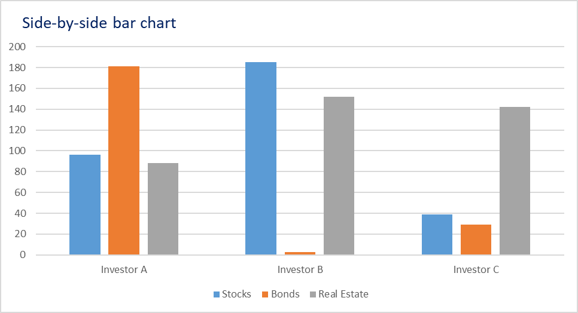
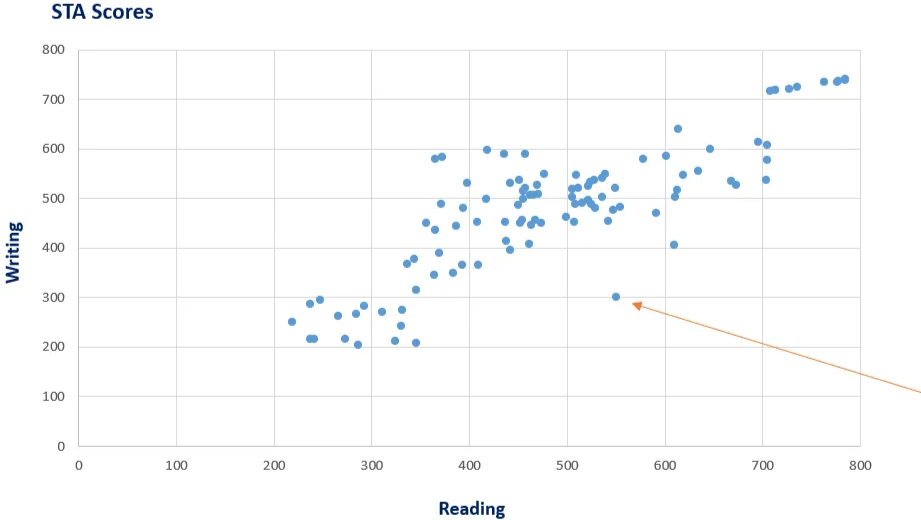

# Cross table and scatter plots

We covered ways (frequency tables and graphs) that only reperesent one variable, to represnt relationships we use cross tables and scatter plots.

## Categorical variables

A cross table (also called a contingency table) is a type of table used in statistics to show the relationship between two categorical variables. It displays the frequency (or count) of observations that fall into each combination of categories. Each cell in the table represents the count of cases for a specific pair of category values.

For example we can have a type of investment (stocks, bonds, real estate)/investor (1st, 2nd..) destribution, where 2 veriables are - type of investment and the investor itself.

| Type of investment \ investor | Investor A | Investor B | Investor C | Total |
| --- | --- | --- | --- | --- |
| Stocks | 96 | 185 | 39 | 320 |
| Bonds | 181 | 3 | 29 | 213 |
| Real Estate | 88 | 152 | 142 | 382 |
| Total | 365 | 340 | 210 | 915 |

Common way to visualize a cross table is a side by side bar chart.

Holdings of each investor in the different types of assets (marked with color). 

## Scatter plot

Example: reading and writing STAs scores of 100 students.

STA score is a number between 200 and 800.

| Student ID | Reading | Writing |
| --- | --- | --- |
| 1 | 273 | 216 |
| 2 | 292 | 282 |
| 3 | 219 | 250 |
| 4 | 241 | 217 |
| 5 | 284 | 266 |
| 6 | 247 | 294 |
| 7 | 237 | 215 |
| 8 | 286 | 203 |
| 9 | 237 | 286 |
| 10 | 266 | 263 |
| 11 | 311 | 270 |
| 12 | 324 | 211 |
| 13 | 330 | 243 |
| 14 | 331 | 275 |
| 15 | 336 | 367 |
| 16 | 344 | 378 |
| 17 | 346 | 315 |
| 18 | 346 | 208 |
| 19 | 356 | 451 |
| 20 | 364 | 346 |
| 21 | 365 | 435 |
| 22 | 365 | 579 |
| 23 | 369 | 390 |
| 24 | 436 | 589 |
| 25 | 393 | 365 |
| 26 | 394 | 480 |
| 27 | 417 | 499 |
| 28 | 438 | 414 |
| 29 | 398 | 530 |
| 30 | 409 | 366 |
| 31 | 437 | 453 |
| 32 | 442 | 396 |
| 33 | 442 | 531 |
| 34 | 408 | 453 |
| 35 | 387 | 444 |
| 36 | 418 | 597 |
| 37 | 461 | 407 |
| 38 | 457 | 589 |
| 39 | 371 | 489 |
| 40 | 383 | 349 |
| 41 | 372 | 584 |
| 42 | 463 | 446 |
| 43 | 452 | 451 |
| 44 | 550 | 300 |
| 45 | 529 | 480 |
| 46 | 578 | 580 |
| 47 | 454 | 457 |
| 48 | 522 | 525 |
| 49 | 554 | 483 |
| 50 | 591 | 470 |
| 51 | 601 | 585 |
| 52 | 610 | 406 |
| 53 | 611 | 503 |
| 54 | 613 | 516 |
| 55 | 614 | 639 |
| 56 | 619 | 546 |
| 57 | 634 | 556 |
| 58 | 646 | 599 |
| 59 | 668 | 534 |
| 60 | 673 | 526 |
| 61 | 696 | 613 |
| 62 | 704 | 536 |
| 63 | 705 | 578 |
| 64 | 705 | 608 |
| 65 | 708 | 717 |
| 66 | 713 | 718 |
| 67 | 713 | 719 |
| 68 | 727 | 720 |
| 69 | 735 | 724 |
| 70 | 763 | 734 |
| 71 | 776 | 735 |
| 72 | 777 | 736 |
| 73 | 785 | 738 |
| 74 | 785 | 740 |
| 75 | 547 | 476 |
| 76 | 507 | 452 |
| 77 | 474 | 451 |
| 78 | 536 | 503 |
| 79 | 455 | 499 |
| 80 | 470 | 509 |
| 81 | 536 | 540 |
| 82 | 522 | 496 |
| 83 | 462 | 507 |
| 84 | 467 | 457 |
| 85 | 477 | 549 |
| 86 | 505 | 519 |
| 87 | 515 | 491 |
| 88 | 450 | 487 |
| 89 | 542 | 455 |
| 90 | 509 | 546 |
| 91 | 455 | 514 |
| 92 | 524 | 533 |
| 93 | 451 | 536 |
| 94 | 505 | 503 |
| 95 | 465 | 507 |
| 96 | 525 | 489 |
| 97 | 508 | 488 |
| 98 | 511 | 520 |
| 99 | 469 | 527 |
| 100 | 457 | 521 |
| 101 | 499 | 462 |
| 102 | 528 | 536 |
| 103 | 539 | 549 |
| 104 | 549 | 521 |

In a scatter plot where the horizontal axis represents reading scores and the vertical axis represents writing scores, we're looking to understand the relationship between the two numerical variables.
We're not focused on individual data point values, but rather on the overall pattern - how the data is distributed and whether there's a positive, negative, or no correlation between reading and writing scores.

This kind of plot helps answer questions like:

- Do students who score high in reading also tend to score high in writing?
- Is there a clear linear trend or are the scores scattered randomly?

We observe that students who score well on the **reading assignment** also tend to score well on the **writing assignment**, indicating a **positive correlation** between the two variables.

Additionally, there is **clustering in the middle** of the plot, suggesting that many students fall within the **average score range** — around **500 points** on both assignments. This concentration highlights the central tendency of the data.

The exceptional students have a tendency to be exceptional on both components.

This is less true for bad students as their performance tends to deviate when performing different tasks.

Also, we have Jane.

Shes away from every other observation. 

> This observation is called outlier as it goes against the logic of a whole dataset.
>